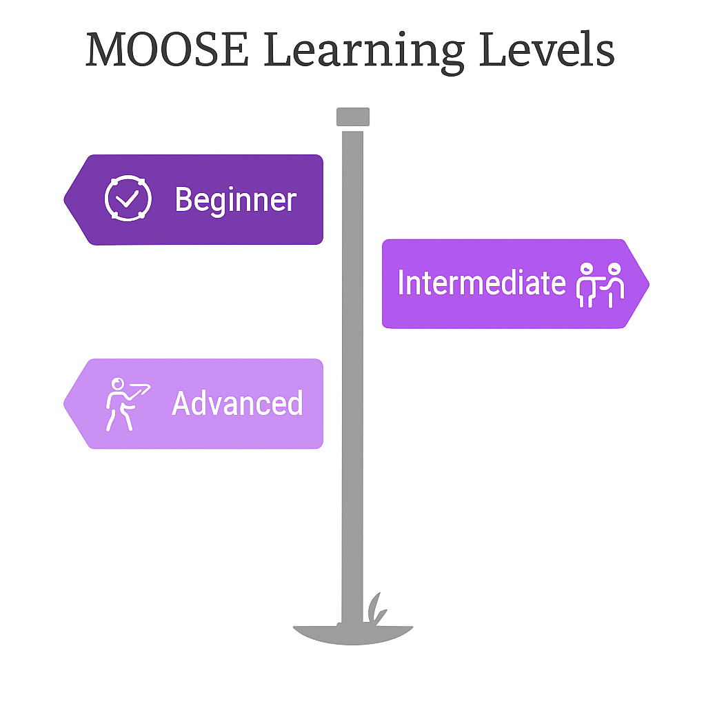

MOOSE Documentation
==============================

Choose your experience level:

.. raw:: html

    

        

            <a href="beginner.html" class="level-link">
                <h3>Beginner</h3>
                
Learn MOOSE basics with tutorials, cookbooks, and examples

            </a>
        

        

            <a href="intermediate.html" class="level-link">
                <h3>Intermediate</h3>
                
In-depth guides and API references

            </a>
        

        

            <a href="advanced.html" class="level-link">
                <h3>Advanced</h3>
                
Complete API references and developer documentation

            </a>
        

    

.. toctree::
   :maxdepth: 2
   :hidden:

   beginner
   intermediate
   advanced
